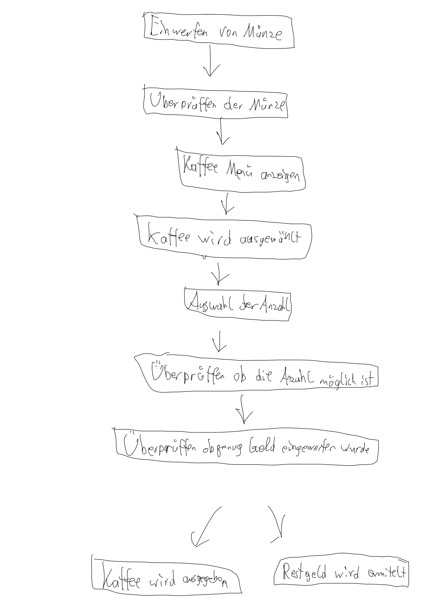
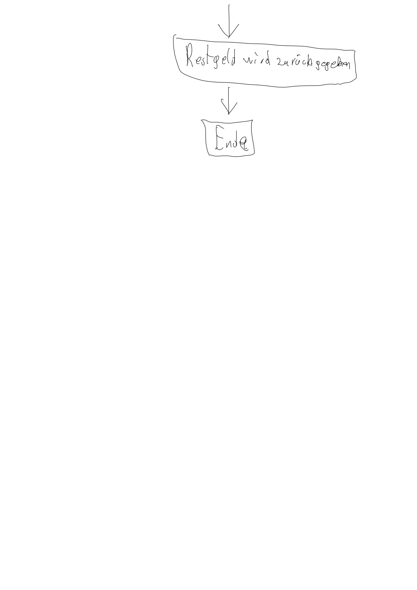

Assignment 4: Algorithms   
Assignment number: 2.1 und 2.2   
Name: Janis Wuga   
Matrikelnummer: 12313444   
Date: 04.12.2023   
My own production  
# Assignment 4.1 - Prime number check   

if n <= 1:   
return "Falscher Wert"  
  
def gcd(a. b):  
while b:  
a, b = b, a % b  
return a
  
for i in range(2, n):  
if gcd(n, i) != 1:
return "keine Primzahl"  
else:  
return "Es ist eine Primzahl"
  
  Erklärung: Zuerst überprüffe ich ob n überhaupt größer als 1 ist. Denn wenn das nicht der Fall ist ist es automatisch schon nicht in der Angabe. Dannach definiere ich was egschehen muss damit ich auf die Primzahl komme mit hilfe von dem Euklidischer Algorithmus. Als nächstes habe ich mit hilfe einem loobs überprüft ob der größte gemeinseme Teiler die 1 ist. Wenn das nicht der Fall war war es keine Primzahl und wenn doch dann ist eine.
    

Die Komplexität wird durch durch die dominanteste Komponente ermittelt und ist deshalb in diesem Fall wegen dem loop O(n).
  
    
# Assignment 4.2 - Coffee Machine  
1. Mensch interagiert mit Maschine  
2. Es wird überprüft ob eine Münze welche akzeptiert wird eingeworfen wurde  
3. Es wird die Anzahl der eingeworfen Münzen ermittelt und deren Wert
4. Zeig an welche Kaffe Optionen es gibt
5. Der Mensch wählt einen KAffe aus  
6. Überprüfe ob genug Geld eingeworfen wurde wenn nicht zeig an wie viel eingeworfen wurde und wie viel fehlt
7. Wenn der Wert stimmt gib den gewählten Kaffe aus
8. Wenn Rückgeld vorhanten dieses Zurück geben
9. End  

# Assignment 4.3 - Python Code  
Zuerst wird die Funktion definiert mithilfe von "myFunction(str):", am start ist my.sum gleich 0. Das geht durch jeden Buchstaben welcher eingegeben wird (Also im String). Wenn die Zahlen nicht alphabetisch sind werden Sie in eine ganze Zahl umgewandelt und zu my_sum dazu gerechnet also addiert. Dannach wird übeprüft ob my_sum größer als 0 ist und durch 10 dividiert werden kann, wenn das der Fall ist "return True" wenn nicht dann "return False". 
Dannach wird möglich gemacht das eine Eingabe gestellt wird. Wenn diese Eingabe es die anforderung entspricht gibt es die Antwort "Yes" und wenn nicht "No"
  
Beispiel 1: a2b5c3  
Antwort 1: "Yes" Da 2+5+3=10 ist und das größer als 0 inst und durch 10 Teilbar ist.  
  
Beispiel 2:  a1b2c3
Antwort 2 "No" Da 1+2+3=6 ist und 6 nicht durch 10 teilbar ist.
